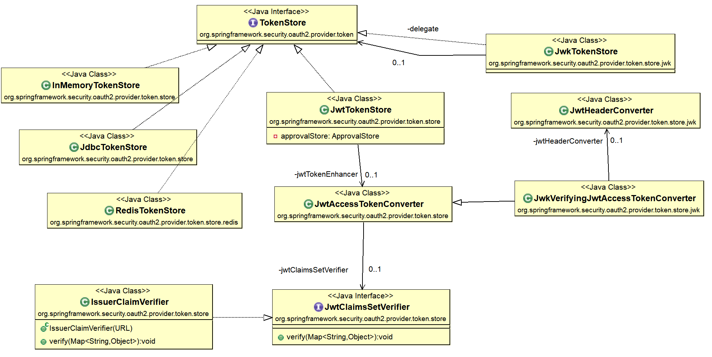
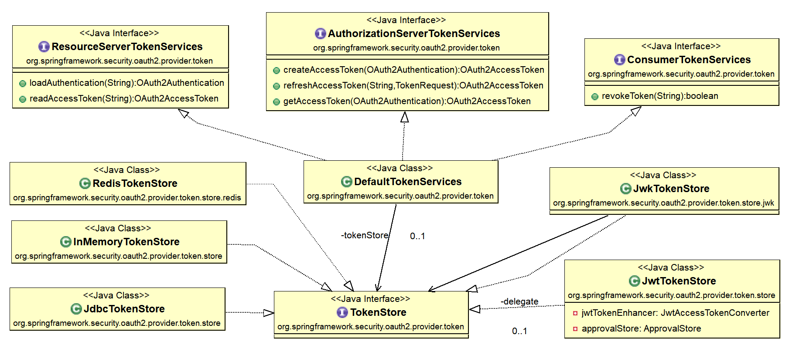
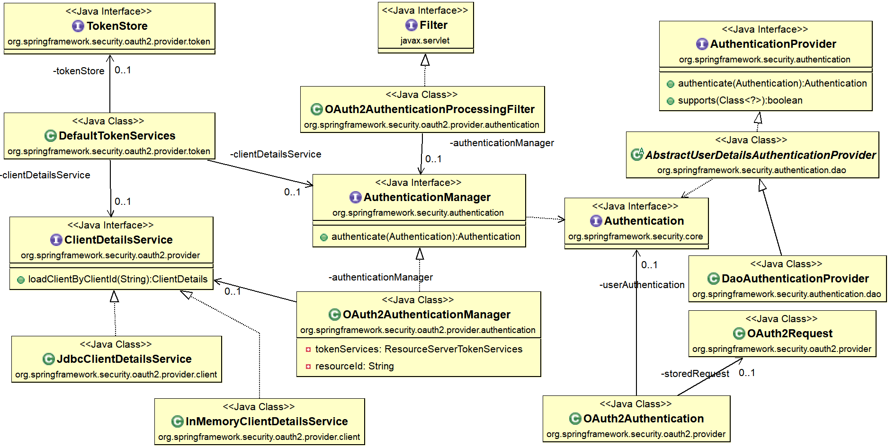
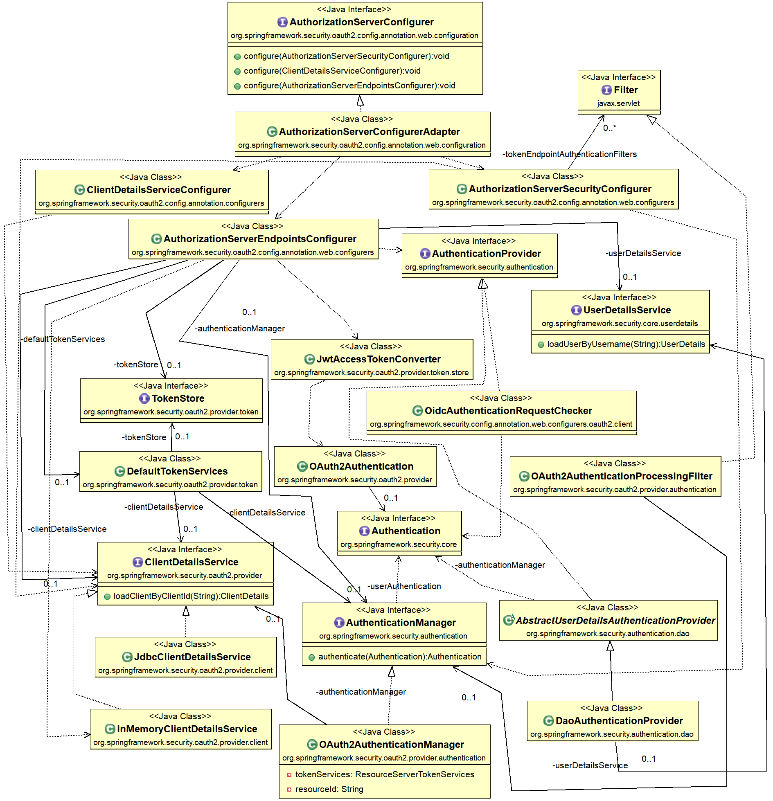
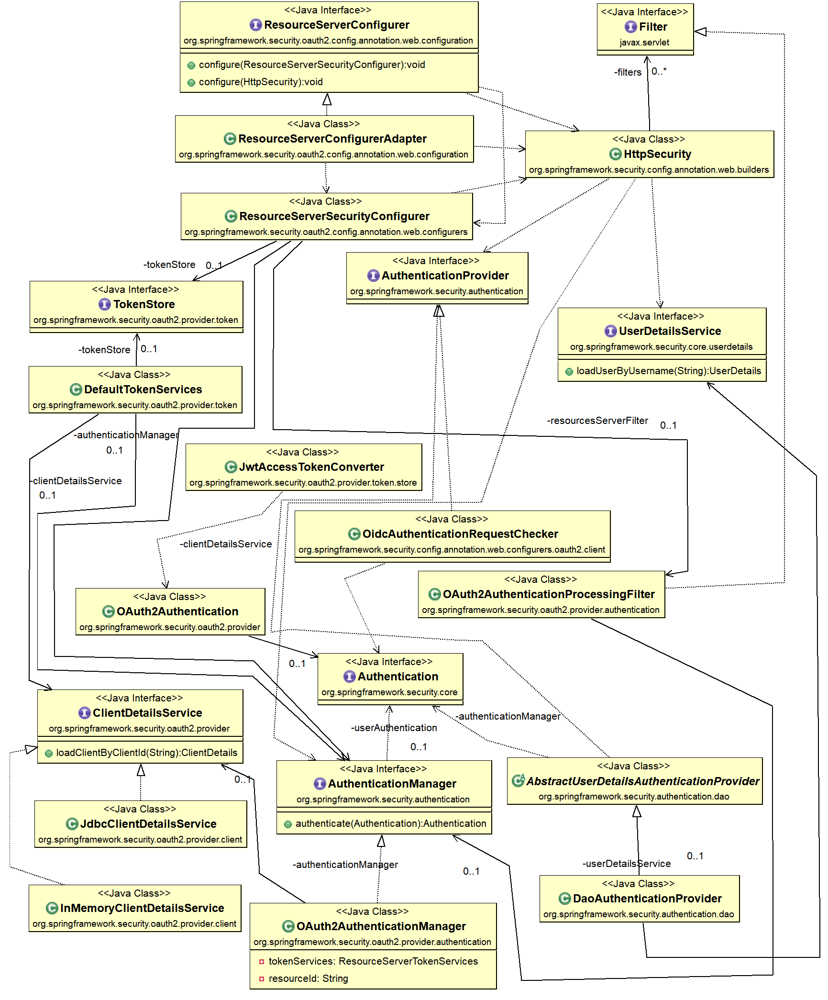

OAuth2 + JWT using Spring Boot 2 / Spring Security 5
---

Read more http://blog.marcosbarbero.com/centralized-authorization-jwt-spring-boot2/

Official Documents  https://docs.spring.io/spring-security-oauth2-boot/docs/current/reference/htmlsingle/

## TokenStore  Relationship


## TokenStore && TokenServices  Relationship


## TokenStore && TokenServices && Spring-Security Relationship


## AuthenticationServerConfiguration && Spring-Security Relationship



## ResourceConfiguration && Spring-Security Relationship


## Add ActiveDirectoryLdap feathers
If you wanna add **ActiveDirectory** / **Ldap** feathers, you can modify the code about com.marcosbarbero.lab.sec.oauth.jwt.config.security.**WebSecurityConfiguration** in **oauth2-jwt-server** .

```java
package com.marcosbarbero.lab.sec.oauth.jwt.config.security;
(ommit..)
@EnableWebSecurity
public class WebSecurityConfiguration extends WebSecurityConfigurerAdapter {

    (ommit..)
    
    //add this below
    private ActiveDirectoryLdapAuthenticationProvider adProvider;
    
    @Override
    protected void configure(final AuthenticationManagerBuilder auth) throws Exception {
        auth.userDetailsService(userDetailsService())
                .passwordEncoder(passwordEncoder());
                
        //for  ActiveDirectory or Ldap  server
       auth.authenticationProvider(adProvider);
    }
   (ommit...)
   
    /***
     * for test ad server 
     * */
    @Bean
	public ActiveDirectoryLdapAuthenticationProvider activeDirectoryLdapAuthenticationProvider() {
    	adProvider = new ActiveDirectoryLdapAuthenticationProvider("iead.local",
				"ldap://192.168.2.12:389", "dc=iead,dc=local");
        
      //notice: why   sAMAccountName={1} ? ,beccause i see the original code
      // about ActiveDirectoryLdapAuthenticationProvider( spring-security-ldap 5.1.6)
      // line 326:  return SpringSecurityLdapTemplate.searchForSingleEntryInternal(context,
      // line 327:         searchControls, searchRoot, searchFilter,
      // line 328:         new Object[] { bindPrincipal, username });
      // username's position is {1} ,not {0}
    	adProvider.setSearchFilter("(&(objectClass=user)(sAMAccountName={1}))");
      
    	adProvider.setConvertSubErrorCodesToExceptions(true);
    	adProvider.setUseAuthenticationRequestCredentials(true);
		return adProvider;
	}
  (ommit...)
}
```
